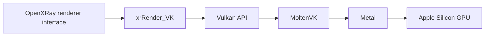

# Metal renderer roadmap

## Goal

Run the OpenXRay Clear Sky renderer on Apple Silicon through Metal, without depending on Apple's deprecated OpenGL implementation, while preserving the existing OpenGL renderer as a working reference.

The current branch is a playable **OpenGL baseline**. It does not contain a Metal backend yet.

## Proposed architecture

The first implementation path is a Vulkan renderer translated to Metal by MoltenVK:

This keeps the engine-facing renderer portable while the macOS build reaches Metal. A direct `xrRender_MTL` backend remains possible later if profiling identifies a limitation that cannot be addressed through MoltenVK.

Before committing the full renderer to this route, a small spike must verify window surfaces, swapchain behavior, shader translation, depth conventions, synchronization, and the Vulkan feature subset exposed on the target macOS version.

## Success criteria

The first useful Metal milestone must:

- launch natively as ARM64;
- create a Metal-backed presentation surface;
- render Clear Sky geometry with correct depth testing;
- support the deferred R2/R3 path required by Clear Sky;
- render sun and local-light shadows without the OpenGL workarounds;
- preserve UI, input, audio, scripting, saving, and loading;
- hold a stable 60 FPS frame cap without runaway presentation;
- produce actionable validation output in Debug builds.

## Phases

### 0. Freeze the OpenGL reference

- Keep a known-good Clear Sky save and camera positions for the indoor sun-shaft and desk-lamp scenes.
- Record screenshots, settings, logs, and frame-time behavior at 60 FPS.
- Keep the current OpenGL fixes isolated and documented.

Exit condition: the OpenGL build is reproducible and can serve as a visual reference.

### 1. Renderer boundary and platform spike

- Map `xrRender_GL`, `xrRender_R2`, `xrRender_R3`, `xrAPI`, and engine module loading.
- Add an experimental renderer module without changing the default renderer.
- Create an SDL Vulkan surface on macOS.
- Select a device and queue, create a swapchain, and present a clear color.
- Enable Vulkan validation in Debug builds.

Exit condition: a native ARM64 OpenXRay window presents frames through MoltenVK and Metal.

**Status.** The platform half is done and the renderer half is not.
`src/Layers/xrRenderPC_VK/vk_probe.cpp`, built by `XRAY_BUILD_VK=ON`, opens an SDL Vulkan
window on Apple Silicon, selects a device and queue, creates a swapchain and presents
animated frames through MoltenVK, with `VK_LAYER_KHRONOS_validation` enabled in Debug. It is
a standalone executable and links nothing from the engine: `IRender` has 112 pure virtual
methods, and stubbing them before knowing whether a surface could be presented would have
buried the risk under boilerplate.

Still open in this phase: registering a `RendererModule`, and therefore presenting from the
engine's own window rather than the probe's. The measured driver baseline is recorded in
[BACKEND_OPTIONS.md](BACKEND_OPTIONS.md); the shader route is in
[SHADER_TRANSLATION_PROBE.md](SHADER_TRANSLATION_PROBE.md).

### 2. Hardware and command backend

- Implement device capability discovery.
- Implement command pools, command buffers, fences, and semaphores.
- Add buffers, images, image views, samplers, and staging uploads.
- Define lifetime and deferred-destruction rules.
- Add render targets and depth/stencil attachments.

Exit condition: a textured geometry sample renders with stable resize and shutdown behavior.

### 3. Shader pipeline

- Define the source path from existing renderer shaders to SPIR-V.
- Reflect resource bindings and constant-buffer layouts.
- Establish explicit clip-space, depth-range, matrix, and Y-axis conventions.
- Cache compiled shaders and pipeline objects.
- Produce readable compiler and validation errors in Debug builds.

Exit condition: static and skinned geometry use translated project shaders rather than test shaders.

### 4. Core Clear Sky rendering

- Port vertex and index submission.
- Port static, dynamic, and skeletal geometry.
- Port depth prepasses and shadow maps.
- Port the G-buffer and material inputs.
- Port sun, point, and spot lighting.

Exit condition: the reference Clear Sky level is navigable with correct opaque geometry, depth, and basic lighting.

### 5. Effects and presentation

- Port volumetric lights and sun shafts.
- Port particles, alpha-tested geometry, transparency, and decals.
- Port post-processing, tone mapping, and anti-aliasing.
- Port UI composition and screenshots.
- Handle window resize, fullscreen, VSync, and frame limiting.

Exit condition: the Metal path is visually comparable with the OpenGL reference scenes.

### 6. Stability and performance

- Fix validation errors before performance tuning.
- Capture CPU and GPU frame timelines with Instruments and Metal tools.
- Remove avoidable resource uploads and pipeline creation during frames.
- Test save/load transitions and multiple levels.
- Package the engine without proprietary game data.

Exit condition: repeatable gameplay sessions run at the 60 FPS development target without validation failures or unbounded thermal load.

## Engineering rules

- Keep renderer-specific code inside the renderer module or narrow platform adapters.
- Keep the OpenGL backend buildable during the transition.
- Make one render stage work before porting the next.
- Treat validation errors as correctness failures.
- Compare against fixed saves and captures rather than memory.
- Do not commit game files, shader caches generated from proprietary data, logs with private paths, or save archives.

## Upstream coordination

OpenXRay asks contributors to discuss major changes before proposing them upstream. Development can continue in this fork; an upstream proposal should begin only after the platform spike demonstrates a maintainable module boundary and a clear shader strategy.
